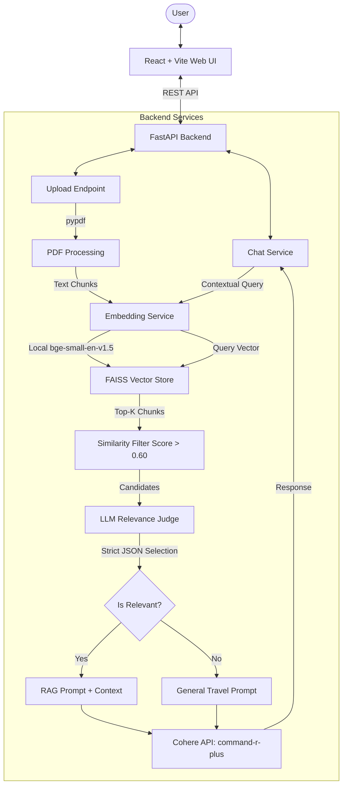

# 🌍 GlobeGuide AI - Submission Document

This document provides detailed answers to the submission requirements for **GlobeGuide AI**, an AI-powered travel assistant that intelligently combines general travel knowledge with Retrieval-Augmented Generation (RAG) using user-uploaded travel guides.

---

## 1. Research Process & Findings

### The Problem
When building a travel assistant, a primary challenge is managing information sources:
1. **General travel questions** (e.g., "What are some travel tips for Japan?") should be answered using the model's vast pre-trained travel knowledge.
2. **Specific documents** (e.g., a custom PDF itinerary or local guide uploaded by the user) should be used when the user asks questions directly related to that guide (e.g., "What is the departure time of my flight in the uploaded guide?").
3. **Preventing Hallucinations & Context Dumping**: Standard RAG pipelines retrieve chunks regardless of whether they contain the answer to the user's question, leading to confusing answers where unrelated documents are cited or mixed into greetings and social chats.

### Tools & Platforms Selection
* **Embedding Model (`BAAI/bge-small-en-v1.5`)**: Selected via Hugging Face and loaded locally using `sentence-transformers`. It provides a state-of-the-art balance between performance, speed, and size (only 130MB, running efficiently on a standard CPU/GPU without calling external embedding APIs).
* **Vector Index (`FAISS`)**: Selected for high-performance, local, in-memory similarity searching. It requires zero cloud configuration, operates with dense vectors via inner product (equivalent to Cosine Similarity when normalized), and supports fast updates.
* **LLM (`Cohere command-r-plus`)**: Configured with a temperature of `0.2` to minimize creative writing and focus strictly on factual retrieval. It performs exceptionally well on long-context processing and RAG reasoning.
* **Backend (`FastAPI`)**: Selected for fast, asynchronous API routing, clear Swagger UI docs, and effortless Python integration.
* **Frontend (`React` + `Vite` + `Tailwind CSS 4.0` + `TypeScript`)**: Chosen for a fast, responsive desktop/mobile UI designed similarly to modern ChatGPT/Gemini interfaces.

### Key Findings & Comparisons
* **Similarity Threshold Filtering**: Setting a threshold of `0.60` ensures that chunks are discarded if there's no semantic overlap with the query.
* **Two-Stage Relevance Validation (LLM Judge)**: Similarity search sometimes yields high scores for irrelevant text (e.g., a guide talking about Sri Lanka when the user asks about the USA, due to words like "flight", "itinerary", "hotel"). We designed a second-stage verification step: the LLM acts as an independent judge using a strict prompt instructions set to filter chunks. It outputs a clean JSON array representing only the valid candidate indexes. This prevents incorrect document retrieval and keeps the chatbot clean.
* **Contextual Query Rewriting**: Users naturally ask follow-ups (e.g., "How long should I stay there?"). Standard query embedding search would fail to find relevant chunks because "there" has no semantic destination meaning. By detecting contextual keywords, the system rewrites the query, merging it with recent user history (e.g., "Italy travel plan. How long should I stay there?") to run the search.

---

## 2. Design & Architecture

### System Architecture Diagram


### Main Components and Workflow
1. **React Frontend**: A clean, single-page application with a sidebar listing uploaded documents, a chat window rendering message balloons, and specialized UI components for displaying source attributions (`SourceReference`) when RAG is active.
2. **FastAPI Backend Routers**:
   * `/upload` receives PDF documents, stores them in `knowledge/uploaded/`, and invokes RAG indexing.
   * `/chat` processes incoming user messages and queries the conversation engine.
3. **RAG Service**: Parses PDFs utilizing `pypdf`, splits text into chunks of 1000 characters with 200 character overlap using LangChain's `RecursiveCharacterTextSplitter`, calls the embedding service to create vector embeddings, and builds a FAISS index stored on disk as `vector_store/faiss.index` along with its serialized `metadata.pkl`.
4. **Chat Service**:
   * Parses social intents (greetings, thanks, help, goodbye) and returns predefined templates directly without LLM API costs.
   * Performs contextual retrieval query construction for pronoun follow-ups.
   * Searches the FAISS index for relevant documents and filters them using a `0.60` similarity threshold.
   * Sends the retrieved chunks to the LLM-based Relevance Judge to filter out false positives.
   * Routes the query to either `build_rag_prompt` (with documents context) or `build_general_prompt` (general travel knowledge), calling the Cohere Chat API for response generation.

---

## 3. Design Decisions & Trade-offs

* **FAISS Indexing vs. Cloud Vector Database (e.g. Pinecone)**:
  * *Decision*: Used local FAISS file storage (`vector_store/faiss.index` + `metadata.pkl`).
  * *Trade-off*: FAISS is in-memory and lightweight, which is perfect for running locally and avoiding external account creation/costs. However, it is not optimized for distributed multi-user production applications or granular document-level deletion. We chose it to prioritize zero-setup local deployment.
* **Local Embeddings (`bge-small-en-v1.5`) vs. OpenAI/Cohere Embeddings API**:
  * *Decision*: Loaded embedding calculations locally.
  * *Trade-off*: Running embeddings locally utilizes CPU/GPU memory on startup, but guarantees offline access for embeddings, zero latency overhead from API network hops, and no cost.
* **Two-Stage Validation (Similarity + LLM Judge)**:
  * *Decision*: An extra LLM call validates candidate chunks before inserting them into the final RAG prompt.
  - *Trade-off*: Adds a small latency overhead (~300-500ms) for the validation check, but significantly improves precision. This keeps the assistant focused on the target query and prevents "context pollution."
* **In-Memory Deque Conversation History**:
  - *Decision*: Restricting conversation memory to the last 4 messages in an in-memory queue.
  - *Trade-off*: Keeps the prompt window small, minimizing token usage and response latency. In a production system, this would be replaced with a database-backed session table (e.g., PostgreSQL / Redis).

---

## 4. Implementation Process

The project was built in the following stages:
1. **Requirements & Architecture Design**: Defined the endpoints (`/chat`, `/upload`, `/upload/documents`) and structured the communication payloads.
2. **Backend Engine**:
   * Developed `EmbeddingService` to load the Hugging Face model locally.
   * Built `RAGService` to handle document extraction, chunking, and FAISS indexing.
   * Implemented conversational logic in `ChatService`, including greeting classification, query rewriting, and LLM-relevance checking.
3. **Frontend Implementation**:
   * Formulated a sleek UI in React + Tailwind CSS with dark-mode styling, transitions, and loading states.
   * Built the file upload area, allowing drag-and-drop or file clicking.
   * Constructed custom chat boxes displaying formatted text and clickable source cards representing PDF metadata.
4. **Testing and Verification**:
   * Verified that general travel prompts (e.g., "places to visit in France") run without document retrieval.
   * Tested file upload (PDF parsing, text chunking, embedding generation, FAISS serialization).
   * Verified RAG behavior (ensuring that query keywords successfully match PDF content and render clickable source references).

---

## 5. Technologies & Platforms Used

### Frontend
* **React** (`v19.2.7`): High-performance UI rendering.
* **Vite** (`v8.1.1`): Next-generation fast frontend builder.
* **Tailwind CSS** (`v4.3.3`): Utility-first CSS styling for sleek layouts.
* **TypeScript** (`v6.0.2`): Typed JavaScript safety.
* **Axios** (`v1.18.1`): HTTP requests client.

### Backend
* **Python** (`v3.10`): Programming language.
* **FastAPI** (`v0.139.0`): Asynchronous ASGI framework.
* **Uvicorn** (`v0.51.0`): ASGI web server.
* **Pydantic** (`v2.13.4`): Data validation and schemas.

### AI / Vector Search / Libraries
* **Cohere SDK** (`v7.0.5`): Used for `command-r-plus` model generation.
* **Sentence Transformers** (`v5.1.0`): Local text embedding extraction.
* **FAISS (CPU)** (`v1.14.3`): Vector indexing and nearest-neighbor search.
* **LangChain Text Splitters** (`v1.1.2`) & **LangChain Core** (`v1.4.9`): Document processing.
* **pypdf** (`v6.14.2`): Local PDF extraction.

---

## 6. Working Prototype URL

* **Local URLs**:
  * **Frontend**: `http://localhost:5173`
  * **Backend API**: `http://localhost:8000`
  * **API Docs (Swagger UI)**: `http://localhost:8000/docs`

### Run Instructions (Local)
1. **Backend**:
   * Set up Python environment: `python -m venv venv`
   * Activate environment: `venv\Scripts\activate` (Windows) or `source venv/bin/activate` (macOS/Linux).
   * Install requirements: `pip install -r Backend/requirements.txt`
   * Create `.env` inside `Backend/` containing:
     ```env
     COHERE_API_KEY=your_cohere_key_here
     COHERE_MODEL=command-r-plus
     ```
   * Run FastAPI: `uvicorn app.main:app --reload` from `Backend/` directory.
2. **Frontend**:
   * Navigate to `Frontend/` folder: `cd Frontend`
   * Install packages: `npm install`
   * Setup `.env.local`: `VITE_API_URL=http://localhost:8000`
   * Start developer server: `npm run dev`

---

## 7. Source Code

* **Repository**: [GlobeGuide AI Repository](https://github.com/SamadhiJagathsiri/Travel_AI_Assistant)
* **Local Source Folders**:
  * Backend Service Code: [Backend/app](file:///F:/Travel_AI_Assistant/Backend/app)
  * Frontend Interface Code: [Frontend/src](file:///F:/Travel_AI_Assistant/Frontend/src)

---

## 8. README with Setup Instructions

The setup process, including environment setup, file layout, and package versions, has been fully documented in the root directory's [README.md](file:///F:/Travel_AI_Assistant/README.md).

---

## 9. Other Notes (Optional)

### Limitations
1. **Vector Index Overwrite**: The current FAISS build writes a new index file whenever a PDF is uploaded. In production, we would append to the index or implement a proper vector store update.
2. **Single-User Memory Session**: The backend chat service manages conversation state globally in-memory. For a multi-user environment, we would tie history to a session ID stored in database sessions.

### Future Enhancements
* **Multi-File Index Merging**: Allowing the user to upload multiple guides and query them all at once.
* **Interactive Maps Integration**: Using Google Maps Platform to dynamically render route paths, local hotels, and restaurants based on LLM recommendations.
* **Voice-Guided AI**: Speech-to-text input and audio output playback for a hands-free travel companion.
